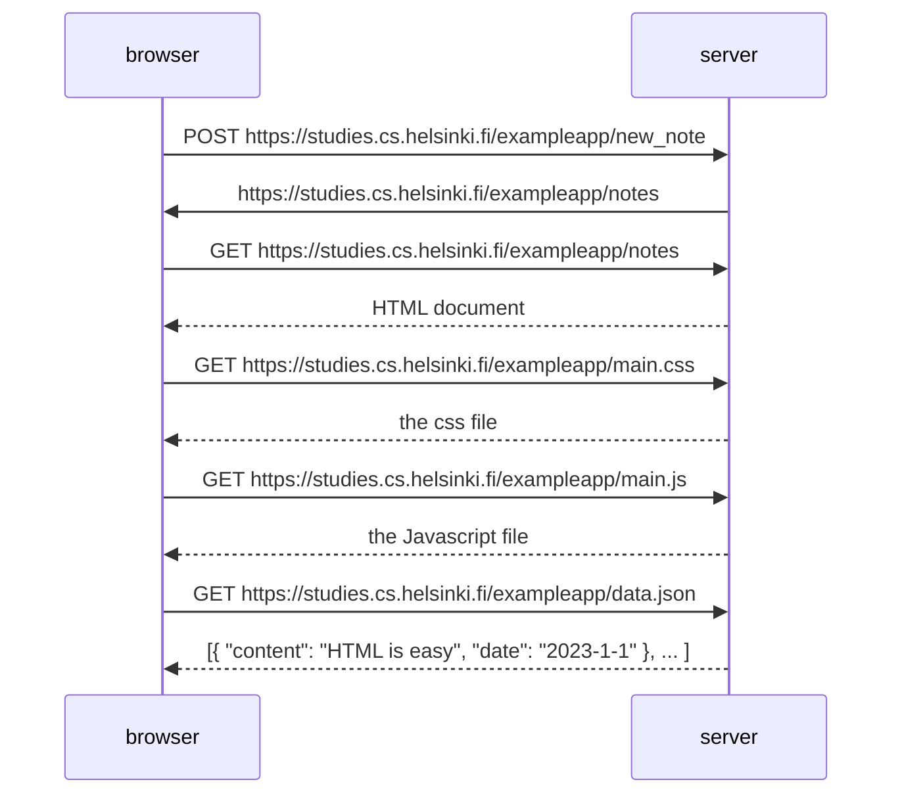

sequenceDiagram
  participant browser
  participant server

  browser-->> server : POST https://studies.cs.helsinki.fi/exampleapp/new_note
  activate server 
  server-->> browser: https://studies.cs.helsinki.fi/exampleapp/notes
  deactivate server

   browser->>server: GET https://studies.cs.helsinki.fi/exampleapp/notes
    activate server
    server-->>browser: HTML document
    deactivate server

  browser->>server: GET https://studies.cs.helsinki.fi/exampleapp/main.css
    activate server
    server-->>browser: the css file
    deactivate server

  browser->>server: GET https://studies.cs.helsinki.fi/exampleapp/main.js
    activate server
    server-->>browser: the JavaScript file
    deactivate server
  
